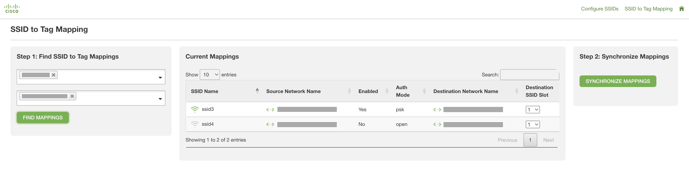

# Meraki SSID Multipurpose Dashboard

This dashboard displays information about Meraki AP's and SSIDs, and it supports the following wireless workflows:
* Configuring SSID's (one of more networks)
* Copying SSIDs to Meraki Networks based on AP Tag (original project: https://github.com/gve-sw/gve_devnet_meraki_ap_configuration_by_tag)

**Note**: SSID configuration includes modifying State, Name, and Auth Mode (and PSK if relevant)

## Contacts
* Danielle Stacy
* Jorge Banegas
* Trevor Maco

## Solution Components
* Meraki MR
* Flask
* Python 3.11

## Prerequisites
#### Meraki API Keys
In order to use the Meraki API, you need to enable the API for your organization first. After enabling API access, you can generate an API key. Follow these instructions to enable API access and generate an API key:
1. Login to the Meraki dashboard
2. In the left-hand menu, navigate to `Organization > Settings > Dashboard API access`
3. Click on `Enable access to the Cisco Meraki Dashboard API`
4. Go to `My Profile > API access`
5. Under API access, click on `Generate API key`
6. Save the API key in a safe place. The API key will only be shown once for security purposes, so it is very important to take note of the key then. In case you lose the key, then you have to revoke the key and a generate a new key. Moreover, there is a limit of only two API keys per profile.

> For more information on how to generate an API key, please click [here](https://developer.cisco.com/meraki/api-v1/#!authorization/authorization). 

> Note: You can add your account as Full Organization Admin to your organizations by following the instructions [here](https://documentation.meraki.com/General_Administration/Managing_Dashboard_Access/Managing_Dashboard_Administrators_and_Permissions).

#### Docker
This app provides a `Docker` file for easy deployment. `Docker` is the recommended deployment method. Install `Docker` [here](https://docs.docker.com/get-docker/).

## Installation/Configuration
1. Clone this repository with `git clone [repository name]`. To find the repository name, click the green `Code` button above the repository files. Then, the dropdown menu will show the https domain name. Click the copy button to the right of the domain name to get the value to replace [repository name] placeholder.
2. Rename the `.env_sample` file to `.env`.
3. Add Meraki API key to environment variable in `.env`:
```dotenv
# Meraki Section
MERAKI_API_KEY=""
```
4. Set up a Python virtual environment. Make sure Python 3 is installed in your environment, and if not, you may download Python [here](https://www.python.org/downloads/). Once Python 3 is installed in your environment, you can activate the virtual environment with the instructions found [here](https://docs.python.org/3/tutorial/venv.html).
5. Install the requirements with `pip3 install -r requirements.txt`

## Usage
To run the program (from the top-level directory), use the following commands to run with python directly:
```
$ python3 flask_app/app.py
```
or with the docker command:
```
$ docker-compose up -d --build
```

**Note**:
* App logs and output are written to stdout console and log files in `flask_app/logs`

Once the app is running, navigate to http://0.0.0.0:5000 to be greeted with the main landing page (overview page):


Select an Organization and Network to see currently configured SSID's and APs.

The remaining pages and workflows are summarized below.

`Configure SSIDs`:


* Modify one or more SSIDs. Select an Organization and one or more Networks to display all available SSIDs. Once an SSID is selected, various fields can be configured, including:
  * Name
  * State
  * Auth Mode (PSK if relevant)
  * etc.

`SSID to Tag Mapping`:



* Map SSIDs to AP's with a tag matching the name of the SSID. Once an organization and one or more networks are selected, AP's in the selected networks reveal their tags, and any SSID with a name matching the tag within the Meraki Org is applied to the AP.

**Note**: If multiple SSIDs share the same name, the SSID configuration in the first alphabetical network name will be applied (ex: ssid3 in 'Network A' over 'ssid3' in 'Network B')


### LICENSE

Provided under Cisco Sample Code License, for details see [LICENSE](LICENSE.md)

### CODE_OF_CONDUCT

Our code of conduct is available [here](CODE_OF_CONDUCT.md)

### CONTRIBUTING

See our contributing guidelines [here](CONTRIBUTING.md)

#### DISCLAIMER:
<b>Please note:</b> This script is meant for demo purposes only. All tools/ scripts in this repo are released for use "AS IS" without any warranties of any kind, including, but not limited to their installation, use, or performance. Any use of these scripts and tools is at your own risk. There is no guarantee that they have been through thorough testing in a comparable environment and we are not responsible for any damage or data loss incurred with their use.
You are responsible for reviewing and testing any scripts you run thoroughly before use in any non-testing environment.